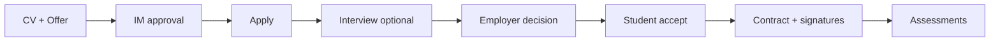

# InternOSE

**Internship management workflow** connecting students, employers, an internship manager, and supervising professors through a gated, multi-step pipeline — from CV and offer validation to hiring, contract signatures, and end-of-internship assessments.

This repository is submitted as evidence of a production-style **multi-party workflow** with human approval gates, role-specific actions, and enforced state transitions.

---

## What the workflow does

InternOSE runs the full internship lifecycle for a Quebec-style academic session (`Winter-YYYY`):

1. **Prepare** — Students upload CVs; employers create internship offers.
2. **Validate (gate)** — An internship manager approves or rejects both CVs and offers before either side can progress.
3. **Match** — Students apply only to approved offers, and only with an approved CV.
4. **Hire** — Employers optionally schedule interviews, then approve or reject candidates; students accept or decline the hire.
5. **Contract** — The internship manager creates the contract; student and employer sign; the manager signs **last**.
6. **Assess** — Employers evaluate the intern; assigned professors evaluate the workplace.

Nothing advances on goodwill alone: each stage is blocked until the previous gate’s status allows it (e.g. no applications without an approved CV, no contract until the student is `HIRED`, no manager signature until both parties have signed).



---

## Who uses it

| Role | Who they are | What they do in the workflow |
|------|----------------|------------------------------|
| **Student** | Co-op / stage candidates | Upload CV, apply to approved offers, accept/reject hires, sign contract |
| **Employer** | Hosting companies | Post offers, review applications, schedule interviews, hire, sign contract, assess the intern |
| **Internship Manager** | Institutional coordinator | Approve/reject CVs and offers, create contracts, sign last, assign professors |
| **Professor** | Academic supervisor | Review assigned contracts, submit site (workplace) assessments |

Students and employers self-register. Internship manager and professor accounts are seeded for demo/demo environments (see below).

---

## One thing that broke during development

**SQL filter patterns returned empty results even when matching data existed.**

Internship-manager search used `LIKE` patterns with `%...%`, but the JDBC/query parameter order was wrong — title and program patterns were swapped relative to the prepared statement. Filters looked “broken” in the UI: valid offers disappeared whenever a search was applied.

**Fix:** Correct the parameter binding order so each `%pattern%` lands on the intended column (`REQUETE SQL; correction de l'ordre du LIKE`). After that, search behaved as users expected.

That incident reinforced a workflow lesson that maps well to agentic systems too: **state and inputs must match the contract of each step**. A small wiring error at a gate (here: query parameters) looks like a product failure even when the rest of the pipeline is fine.

---

## Tech stack

| Layer | Stack |
|-------|--------|
| Frontend | React, TypeScript, React Router 7, Tailwind CSS, i18next (FR default / EN), react-pdf |
| Backend | Spring Boot 3.5, JPA/Hibernate, JWT auth, Maven |
| Database | PostgreSQL (Docker Compose) |
| Architecture | REST API + role-based dashboards |

---

## Run locally

**Prerequisites:** Java 24+, Node.js, Docker.

```bash
# 1. Database
docker compose up -d

# 2. Backend (http://localhost:8080)
./mvnw spring-boot:run

# 3. Frontend (http://localhost:5173)
cd frontend
npm install
npm run dev
```

API base URL: `http://localhost:8080/api`

### Demo accounts

| Role | Email | Password |
|------|-------|----------|
| Employer | `karim@gmail.com` | `Password123!` |
| Student | `alice@gmail.com` | `Password123!` |
| Internship Manager | `bob@gmail.com` | `Password123!` |
| Professor | `toto@gmail.com` | `Password123!` |

> Note: Hibernate is configured with `ddl-auto=create`, so the schema and seed data reset on each backend restart.

---

## Suggested walkthrough (2–3 minutes)

1. Log in as **Internship Manager** → approve a pending CV and a pending offer.
2. Log in as **Student** → apply to the approved offer.
3. Log in as **Employer** → review the application (optionally schedule an interview) → approve the candidate.
4. Log in as **Student** → accept the hire.
5. Log in as **Internship Manager** → create the contract → wait for student & employer signatures → sign last → assign a professor.
6. Log in as **Employer** / **Professor** → submit assessments once the contract is fully signed.

---

## Project structure

```
InternOse/
├── frontend/          # React + TypeScript UI
├── src/main/java/     # Spring Boot API (controllers, services, models, security)
├── docker-compose.yml # PostgreSQL
└── pom.xml            # Backend build
```

Key backend domains: `StudentService`, `EmployerService`, `InternshipManagerService`, `ProfessorService` under `src/main/java/cal/ose/internose/service/`.

---

## Why this fits an “agentic workflow” brief

InternOSE is not an LLM agent — it is a **deterministic, multi-actor workflow** with:

- Explicit stages and status machines  
- Human-in-the-loop approval gates  
- Ordering constraints (e.g. signature sequence)  
- Role-scoped actions and session-scoped data  

Those are the same building blocks used when implementing agentic workflows: map the process, enforce transitions, keep humans at high-stakes steps, and make failures at a gate diagnosable.
