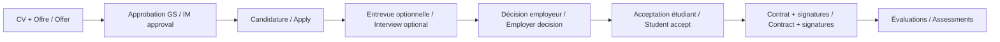

# InternOSE

**FR :** Flux de gestion de stages qui relie étudiants, employeurs, gestionnaire de stages et professeurs superviseurs dans un pipeline multi-étapes avec portes d’approbation, de la validation des CV et offres jusqu’à l’embauche, les signatures de contrat et les évaluations de fin de stage.

**EN :** Internship management workflow connecting students, employers, an internship manager, and supervising professors through a gated, multi-step pipeline, from CV and offer validation to hiring, contract signatures, and end-of-internship assessments.

Ce dépôt / This repository : preuve d’un **workflow multi-acteurs** avec portes d’approbation humaines, actions par rôle et transitions d’état contrôlées · evidence of a production-style **multi-party workflow** with human approval gates, role-specific actions, and enforced state transitions.

---

## Ce que fait le workflow / What the workflow does

**FR :** InternOSE couvre le cycle de vie complet d’un stage pour une session académique de type québécois (`Winter-YYYY`) :

1. **Préparer :** Les étudiants téléversent leur CV ; les employeurs créent des offres de stage.
2. **Valider (porte) :** Le gestionnaire de stages approuve ou refuse les CV et les offres avant toute suite.
3. **Mettre en relation :** Les étudiants postulent uniquement aux offres approuvées, et seulement avec un CV approuvé.
4. **Embaucher :** Les employeurs planifient éventuellement une entrevue, puis approuvent ou refusent ; les étudiants acceptent ou déclinent l’offre.
5. **Contracter :** Le gestionnaire crée le contrat ; l’étudiant et l’employeur signent ; le gestionnaire signe **en dernier**.
6. **Évaluer :** Les employeurs évaluent le stagiaire ; les professeurs assignés évaluent le milieu de stage.

Rien n’avance tant que le statut de la porte précédente ne l’autorise pas (ex. : pas de candidature sans CV approuvé, pas de contrat tant que l’étudiant n’est pas `HIRED`, pas de signature du gestionnaire tant que les deux parties n’ont pas signé).

**EN :** InternOSE runs the full internship lifecycle for a Quebec-style academic session (`Winter-YYYY`) :

1. **Prepare :** Students upload CVs; employers create internship offers.
2. **Validate (gate) :** An internship manager approves or rejects both CVs and offers before either side can progress.
3. **Match :** Students apply only to approved offers, and only with an approved CV.
4. **Hire :** Employers optionally schedule interviews, then approve or reject candidates; students accept or decline the hire.
5. **Contract :** The internship manager creates the contract; student and employer sign; the manager signs **last**.
6. **Assess :** Employers evaluate the intern; assigned professors evaluate the workplace.

Nothing advances until the previous gate’s status allows it (e.g. no applications without an approved CV, no contract until the student is `HIRED`, no manager signature until both parties have signed).



---

## Qui l’utilise / Who uses it

| Rôle / Role | Qui / Who | Rôle dans le workflow / What they do |
|-------------|-----------|--------------------------------------|
| **Étudiant / Student** | Candidats stage / co-op | Téléverser un CV, postuler, accepter/refuser, signer · Upload CV, apply, accept/reject hire, sign |
| **Employeur / Employer** | Entreprises d’accueil / Host companies | Offres, candidatures, entrevues, embauche, signature, évaluation · Post offers, review apps, interview, hire, sign, assess intern |
| **Gestionnaire de stages / Internship Manager** | Coordinateur institutionnel | Approuver CV/offres, créer contrats, signer en dernier, assigner professeurs · Approve CVs/offers, create contracts, sign last, assign professors |
| **Professeur / Professor** | Superviseur académique | Contrats assignés, évaluation du milieu · Review assigned contracts, submit site assessment |

**FR :** Les étudiants et employeurs s’inscrivent eux-mêmes. Les comptes gestionnaire et professeur sont préchargés pour la démo.  
**EN :** Students and employers self-register. Internship manager and professor accounts are seeded for demo (see below).

---

## Ce qui a cassé / One thing that broke during development

**FR : Les filtres SQL renvoyaient des résultats vides alors que des données correspondantes existaient.**

La recherche du gestionnaire utilisait des motifs `LIKE` avec `%...%`, mais l’ordre des paramètres JDBC était incorrect : les motifs titre et programme étaient inversés. Dans l’interface, les offres valides disparaissaient dès qu’une recherche était appliquée.

**Correctif :** Réordonner le binding des paramètres (`REQUETE SQL; correction de l'ordre du LIKE`).

**EN : SQL filter patterns returned empty results even when matching data existed.**

Internship-manager search used `LIKE` patterns with `%...%`, but the JDBC parameter order was wrong: title and program patterns were swapped. Valid offers disappeared in the UI whenever a search was applied.

**Fix:** Correct the parameter binding order so each `%pattern%` lands on the intended column (`REQUETE SQL; correction de l'ordre du LIKE`).

**FR / EN :** Leçon / Lesson : l’état et les entrées doivent respecter le contrat de chaque étape · **state and inputs must match the contract of each step**. Une petite erreur à une porte peut faire paraître tout le pipeline cassé · a small wiring error at a gate looks like a full product failure.

---

## Stack technique / Tech stack

| Couche / Layer | Technologies |
|----------------|--------------|
| Frontend | React, TypeScript, React Router 7, Tailwind CSS, i18next (FR default / EN), react-pdf |
| Backend | Spring Boot 3.5, JPA/Hibernate, JWT, Maven |
| Base de données / Database | PostgreSQL (Docker Compose) |
| Architecture | API REST + tableaux de bord par rôle / role-based dashboards |

---

## Lancer en local / Run locally

**Prérequis / Prerequisites :** Java 24+, Node.js, Docker.

```bash
# 1. Base de données / Database
docker compose up -d

# 2. Backend (http://localhost:8080)
./mvnw spring-boot:run

# 3. Frontend (http://localhost:5173)
cd frontend
npm install
npm run dev
```

API : `http://localhost:8080/api`

### Comptes de démo / Demo accounts

| Rôle / Role | Courriel / Email | Mot de passe / Password |
|-------------|------------------|-------------------------|
| Employeur / Employer | `karim@gmail.com` | `Password123!` |
| Étudiant / Student | `alice@gmail.com` | `Password123!` |
| Gestionnaire / Internship Manager | `bob@gmail.com` | `Password123!` |
| Professeur / Professor | `toto@gmail.com` | `Password123!` |

> Hibernate `ddl-auto=create` : schéma et données de démo réinitialisés à chaque redémarrage du backend · schema and seed data reset on each backend restart.

---

## Parcours suggéré / Suggested walkthrough (2-3 min)

1. **Gestionnaire / Internship Manager** → approuver un CV et une offre · approve a pending CV and offer.
2. **Étudiant / Student** → postuler à l’offre · apply to the approved offer.
3. **Employeur / Employer** → traiter la candidature (entrevue optionnelle) → approuver · review application (optional interview) → approve.
4. **Étudiant / Student** → accepter l’embauche · accept the hire.
5. **Gestionnaire / Internship Manager** → créer le contrat → signatures étudiant & employeur → signer en dernier → assigner un professeur · create contract → wait for signatures → sign last → assign professor.
6. **Employeur / Professeur** → soumettre les évaluations · submit assessments once fully signed.

---

## Structure du projet / Project structure

```
InternOse/
├── frontend/          # React + TypeScript UI
├── src/main/java/     # Spring Boot API
├── docker-compose.yml # PostgreSQL
└── pom.xml            # Backend build
```

Services clés / Key services : `StudentService`, `EmployerService`, `InternshipManagerService`, `ProfessorService` → `src/main/java/cal/ose/internose/service/`.

---

## Pourquoi ça convient à un brief « agentic workflow » / Why this fits

**FR :** InternOSE n’est pas un agent LLM : c’est un **workflow déterministe multi-acteurs** avec :

- Étapes explicites et machines à états  
- Portes d’approbation humaines (human-in-the-loop)  
- Contraintes d’ordre (séquence des signatures)  
- Actions scopées par rôle et données scopées par session  

**EN :** InternOSE is not an LLM agent: it is a **deterministic, multi-actor workflow** with:

- Explicit stages and status machines  
- Human-in-the-loop approval gates  
- Ordering constraints (e.g. signature sequence)  
- Role-scoped actions and session-scoped data  

Mêmes briques que pour des workflows agentiques / Same building blocks as agentic workflows : cartographier le processus, appliquer les transitions, garder l’humain aux étapes critiques, diagnostiquer les échecs à une porte · map the process, enforce transitions, keep humans at high-stakes steps, make gate failures diagnosable.
